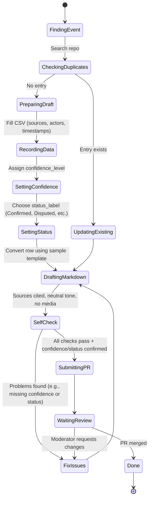

# Contributor State Machine (Mermaid)

```mermaid
stateDiagram-v2
    [*] --> FindingEvent
    FindingEvent --> CheckingDuplicates : Search repo
    CheckingDuplicates --> UpdatingExisting : Entry exists
    CheckingDuplicates --> PreparingDraft : No entry
    PreparingDraft --> RecordingData : Fill CSV (sources, actors, timestamps)
    RecordingData --> SettingConfidence : Assign confidence_level
    SettingConfidence --> SettingStatus : Choose status_label (Confirmed, Disputed, etc.)
    SettingStatus --> DraftingMarkdown : Convert row using sample template
    UpdatingExisting --> DraftingMarkdown
    DraftingMarkdown --> SelfCheck : Sources cited, neutral tone, no media
    SelfCheck --> FixIssues : Problems found (e.g., missing confidence or status)
    FixIssues --> DraftingMarkdown
    SelfCheck --> SubmittingPR : All checks pass + confidence/status confirmed
    SubmittingPR --> WaitingReview
    WaitingReview --> FixIssues : Moderator requests changes
    WaitingReview --> Done : PR merged
    Done --> [*]
```

> Highlights where contributors must capture `confidence_level` and `status_label` before opening a PR.
