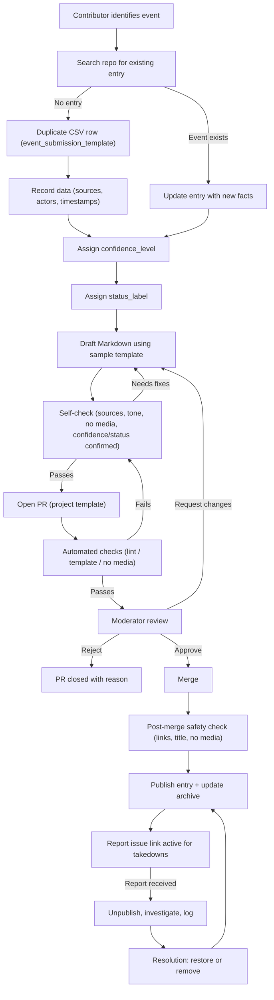

# Submission → Moderation Flow (Mermaid diagram)

```mermaid
graph TD
    A["Contributor identifies event"] --> B["Search repo for existing entry"];
    B -->|Event exists| C["Update entry with new facts"];
    B -->|No entry| D["Duplicate CSV row (event_submission_template)"];
    D --> E["Record data (sources, actors, timestamps)"];
    E --> F["Assign confidence_level"];
    F --> G["Assign status_label"];
    G --> H["Draft Markdown using sample template"];
    C --> F;
    H --> I["Self-check (sources, tone, no media, confidence/status confirmed)"];
    I -->|Needs fixes| H;
    I -->|Passes| J["Open PR (project template)"];
    J --> K["Automated checks (lint / template / no media)"];
    K -->|Fails| I;
    K -->|Passes| L["Moderator review"];
    L -->|Request changes| H;
    L -->|Reject| M["PR closed with reason"];
    L -->|Approve| N["Merge"];
    N --> O["Post-merge safety check (links, title, no media)"];
    O --> P["Publish entry + update archive"];
    P --> Q["Report issue link active for takedowns"];
    Q -->|Report received| R["Unpublish, investigate, log"];
    R --> S["Resolution: restore or remove"];
    S --> P;
```

> Shows the entire lifecycle from contributor work to moderator actions and takedown handling.
