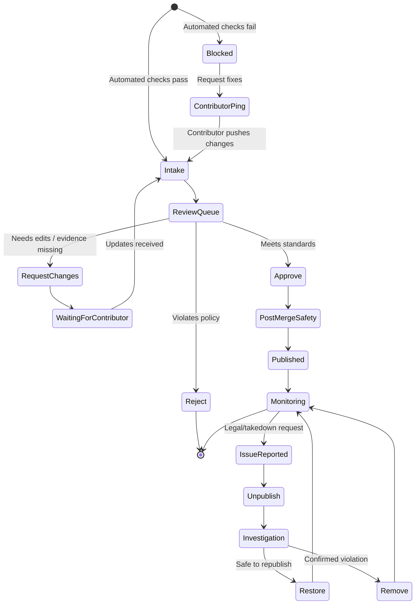

# Moderator & Issue Response State Machine (Mermaid)

```mermaid
stateDiagram-v2
    [*] --> Intake : Automated checks pass
    [*] --> Blocked : Automated checks fail
    Blocked --> ContributorPing : Request fixes
    ContributorPing --> Intake : Contributor pushes changes
    Intake --> ReviewQueue
    ReviewQueue --> RequestChanges : Needs edits / evidence missing
    ReviewQueue --> Reject : Violates policy
    ReviewQueue --> Approve : Meets standards
    RequestChanges --> WaitingForContributor
    WaitingForContributor --> Intake : Updates received
    Reject --> [*]
    Approve --> PostMergeSafety
    PostMergeSafety --> Published
    Published --> Monitoring
    Monitoring --> IssueReported : Legal/takedown request
    IssueReported --> Unpublish
    Unpublish --> Investigation
    Investigation --> Restore : Safe to republish
    Investigation --> Remove : Confirmed violation
    Restore --> Monitoring
    Remove --> Monitoring
    Monitoring --> [*]
```

> Use this in onboarding decks or docs so moderators understand every decision state.
